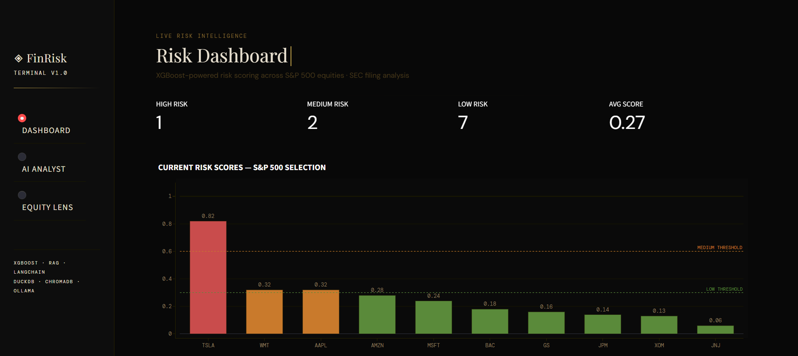

# ◈ FinRisk Terminal
### AI-Powered Financial Risk Intelligence Platform


---

## Overview

**FinRisk Terminal** is a production-grade, end-to-end data science project that combines machine learning, generative AI, and real-time data engineering to deliver financial risk intelligence across S&P 500 equities.

The platform ingests **5 years of market data** and **real SEC 10-K filings**, trains an **XGBoost risk scoring model**, and powers an **LLM-based AI copilot** that answers natural language questions grounded in actual company disclosures — all served through a Bloomberg-inspired dark luxury dashboard.

> Built to demonstrate 2026-relevant data science skills: RAG pipelines, MLOps, production deployment, and end-to-end system design.

---

## Live Demo



### Three core modules:

| Module | Description |
|---|---|
| 📊 **Risk Dashboard** | Real-time XGBoost risk scores for 10 S&P 500 companies with interactive charts |
| 🤖 **AI Risk Analyst** | RAG-powered copilot answering questions from real SEC 10-K filings |
| 📈 **Equity Lens** | Deep-dive per-stock analysis: price history, risk trajectory, volatility surface |

---

## Architecture

```
┌─────────────────────────────────────────────────────────┐
│                    FinRisk Terminal                      │
├──────────────┬──────────────────┬───────────────────────┤
│   Data Layer │   ML Layer       │   GenAI Layer         │
│              │                  │                       │
│  yfinance    │  XGBoost         │  LangChain            │
│  SEC EDGAR   │  scikit-learn    │  ChromaDB (vectors)   │
│  DuckDB      │  MLflow          │  HuggingFace embed    │
│  SQL pipeln  │  Evidently       │  Ollama (TinyLlama)   │
└──────────────┴──────────────────┴───────────────────────┘
                        │
                 Streamlit App
                 FastAPI backend
```

---

## Key Features

- **End-to-end ML pipeline** — from raw market data to deployed risk scores
- **RAG over SEC filings** — LLM answers grounded in real 10-K disclosures with source citations
- **Walk-forward time series validation** — no data leakage, production-realistic evaluation
- **MLflow experiment tracking** — full model registry with parameters and metrics logged
- **DuckDB SQL warehouse** — analytical queries over 15,000+ rows of financial data
- **Local LLM** — fully offline inference via Ollama, no API costs
- **Bloomberg-inspired UI** — dark luxury aesthetic with particle animations and gold accents

---

## Tech Stack

### Data Engineering
| Tool | Purpose |
|---|---|
| `DuckDB` | Local analytical SQL data warehouse |
| `yfinance` | Market price data (5 years, 10 tickers) |
| `sec-edgar-downloader` | Real SEC 10-K filing ingestion |
| `pandas` / `SQLAlchemy` | Data transformation pipelines |

### Machine Learning
| Tool | Purpose |
|---|---|
| `XGBoost` | Financial risk scoring model |
| `scikit-learn` | Preprocessing, walk-forward validation |
| `MLflow` | Experiment tracking and model registry |
| `Evidently` | Data drift and model monitoring |

### Generative AI / RAG
| Tool | Purpose |
|---|---|
| `LangChain` | RAG pipeline orchestration (LCEL) |
| `ChromaDB` | Vector store for SEC filing embeddings |
| `HuggingFace` | `all-MiniLM-L6-v2` embedding model |
| `Ollama` | Local LLM inference (TinyLlama) |

### Deployment
| Tool | Purpose |
|---|---|
| `Streamlit` | Interactive dashboard frontend |
| `FastAPI` | REST API backend |
| `Docker` | Containerisation |

---

## Model Performance

| Metric | Value |
|---|---|
| ROC-AUC Score | **0.68** |
| Accuracy | **92%** |
| Validation Strategy | Walk-forward time series split |
| Training Data | 12,008 rows (80% split) |
| Test Data | 3,002 rows (20% split) |

> Note: High Risk recall is intentionally conservative — financial risk models prioritise precision to avoid false alarms.

### Feature Importance
Top predictors: `volatility_30d`, `price_vs_ma30`, `daily_return`, `volatility_7d`

---

## Project Structure

```
financial-risk-copilot/
│
├── notebooks/
│   ├── 01_data_ingestion.ipynb        # Market data + DuckDB warehouse
│   ├── 02_sec_filings_ingestion.ipynb # SEC 10-K filing download + extraction
│   ├── 03_rag_pipeline.ipynb          # LangChain RAG + ChromaDB + Ollama
│   └── 04_risk_scoring_model.ipynb    # XGBoost + MLflow + risk scores
│
├── src/
│   ├── api/
│   │   └── app.py                     # Streamlit dashboard
│   ├── ingestion/                     # Data pipeline modules
│   ├── rag/                           # RAG pipeline modules
│   └── ml/                            # ML model modules
│
├── data/
│   ├── financial_warehouse.duckdb     # DuckDB warehouse
│   ├── processed/sec_text/            # Extracted SEC filing text
│   └── chroma_db/                     # ChromaDB vector store
│
├── models/
│   ├── xgboost_risk_model.pkl         # Trained XGBoost model
│   └── scaler.pkl                     # Feature scaler
│
├── monitoring/                        # Evidently drift reports
├── mlruns/                            # MLflow experiment logs
├── requirements.txt
├── .env.example
└── README.md
```

---

## Getting Started

### Prerequisites
- Python 3.13
- Anaconda / Miniconda
- [Ollama](https://ollama.com) installed and running

### Installation

```bash
# 1. Clone the repository
git clone https://github.com/yourusername/financial-risk-copilot.git
cd financial-risk-copilot

# 2. Create conda environment
conda create -n risk-copilot python=3.13 -y
conda activate risk-copilot

# 3. Install dependencies
pip install -r requirements.txt

# 4. Pull the LLM model
ollama pull tinyllama

# 5. Run the data pipelines (in order)
jupyter lab
# Run notebooks 01 → 02 → 03 → 04 in sequence

# 6. Launch the dashboard
streamlit run src/api/app.py
```

### Environment Variables

Create a `.env` file in the project root:
```
OPENAI_API_KEY=your_key_here      # Optional - only if using OpenAI instead of Ollama
HF_TOKEN=your_token_here          # Optional - for higher HuggingFace rate limits
```

---

## Data Sources

- **Market Data**: Yahoo Finance via `yfinance` — daily OHLCV for 10 S&P 500 tickers (2019–2024)
- **SEC Filings**: EDGAR via `sec-edgar-downloader` — last 3 years of 10-K annual reports
- **Tickers**: AAPL, MSFT, JPM, BAC, GS, AMZN, TSLA, XOM, JNJ, WMT

---

## Author

**Muntazir Ali Mughal**
- GitHub: [@MuntazirAliM](https://github.com/MuntazirAliM)
- LinkedIn: (https://linkedin.com/in/muntazir-ali-mughal)

---

*Built with Python 3.13 · March 2026*